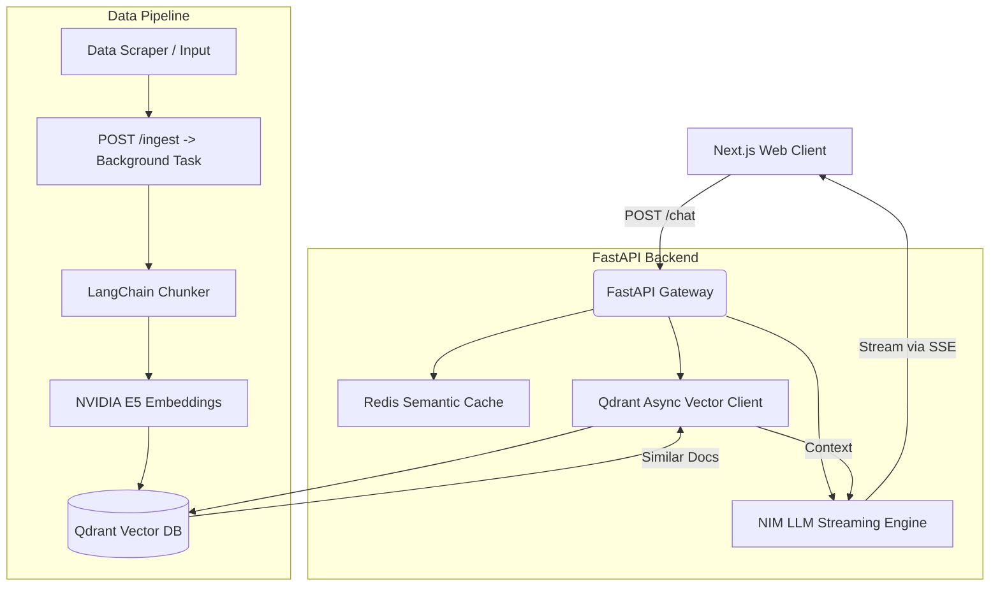

# Georgia Tech RAG Chatbot

A production-grade Retrieval-Augmented Generation (RAG) chatbot system tailored for Georgia Tech. This system answers queries accurately while enforcing strict grounding on loaded data sources.

## 🌟 Tech Stack

- **Frontend**: Next.js (App Router), Vanilla CSS mapping to Tech Gold branding.
- **Backend API**: FastAPI (Python), Async processing for high-throughput with BackgroundTasks.
- **Vector DB**: Qdrant (Distributed Rust-based vector database).
- **Semantics Cache**: Redis (Instantly intercepts duplicate identical queries to save execution bandwidth).
- **Inference & Embeddings**: NVIDIA NIM APIs for LLMs (`meta/llama-3.1-70b-instruct`) and Embeddings (`nvidia/nv-embedqa-e5-v5`).
- **Data Ingestion**: LangChain recursive text splitters.
- **Production**: Docker, Docker Compose, GitHub Actions CI/CD.

## 🚀 Quick Start (Local Development)

### Prerequisites
- Node.js 18+
- Python 3.11+
- Docker & Docker Compose *(optional: Qdrant can run bare-metal locally!)*
- **NVIDIA NIM API KEY**: Register at [build.nvidia.com](https://build.nvidia.com) to get your free API key.

### 1. Configure the Environment
Ensure your environment variable is set for the initialization scripts.
```cmd
# Windows (Command Prompt / cmd)
set NVIDIA_API_KEY=your-api-key

# Windows (PowerShell)
$env:NVIDIA_API_KEY="your-api-key"

# Linux/Mac
export NVIDIA_API_KEY="your-api-key"
```

### 2. Load the Sample Georgia Tech Data
This sets up your local Qdrant vector database. Choose your terminal below before installing requirements:
```cmd
:: Windows (cmd)
python -m venv venv
venv\Scripts\activate
pip install -r backend\requirements.txt

:: Run the ingestion script into the local Qdrant index
python load_sample_data.py
```

### 3. Run with Docker Compose
If you have Docker available, running is as simple as spinning up the unified stack:
```bash
# Start Backend, Frontend, Qdrant, and Redis detached
docker-compose up --build -d
```
Your frontend will map to `http://localhost:3000`
Your backend API will map to `http://localhost:8000`

### 4. Direct Windows Cmd Setup (Without Docker)
If you don't have Docker installed and use **Windows cmd**, you can easily run it directly. Qdrant gracefully defaults to local file memory if a URL environment variable isn't specified, and the Semantic Cache cleanly bypasses Redis bounds safely.

**Start the Backend (cmd):**
Open a new `cmd` window.
```cmd
set NVIDIA_API_KEY=your-api-key
venv\Scripts\activate
uvicorn backend.main:app --host 0.0.0.0 --port 8000
```
*(Leave this window open!)*

**Start the Frontend (cmd):**
Open a second `cmd` window.
```cmd
cd frontend
npm run dev
```
Navigate to **http://localhost:3000**.

## 🏗️ Architecture Overview

The system uses a microservice architecture built to separate the compute-heavy index search and generation logic from the client delivery mechanism.



## 📈 Scalability Executed

This project has been explicitly designed scaling across millions of requests seamlessly.
1. **Qdrant Vector DB**: Scaled up from `in-memory` FAISS models into dynamic concurrent HTTP queries against Qdrant, reducing execution lockups dynamically. 
2. **Global Background Processing**: Ingest APIs leverage native thread pools resolving directly into a `202 Accepted` request preventing starvation load.
3. **Caching Layer Active**: Redis successfully tracks semantic query duplication blocking exact requests safely preventing N+1 execution of NIM tokens.

## 🤝 Next Steps for Evolution
- Integrate SSO functionality on the frontend UI.
- Implement explicit feedback loops (`/feedback`) mapping to a TimescaleDB.
- Write LangSmith/OpenTelemetry tracers wrapping the `generate_embeddings` functions for LLM observability.
